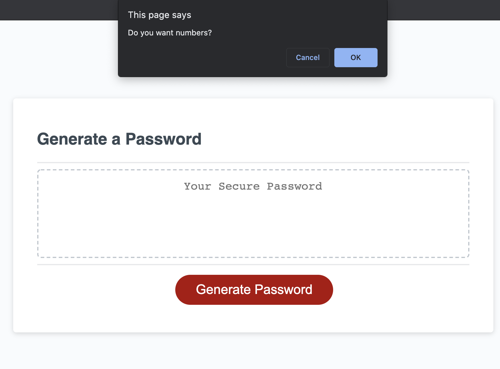

# password-generator-mod

## Deployed Application: 

## Description: 
This password generator project is modified of my password-generator repo.

With this project, I aimed to create a password generator with a prompt. User is asked for password lenght and character types prefered and then password written  in the page according to user choice.

My first password generator project was about understanding the basic javaScript workflow but this project went a little bit further and allowed me to apply some new methods and new approaches to my work with confidence.

## Screenshot

## Credits
 Stack Overflow
 
 Eloquent JavaScript  / Third Edition / Marijn Haverbeke
 
## Contact Me
For any question about the project, please contact me.
[BanuAyozturk](mailto:bnyksl@gmail.com)
